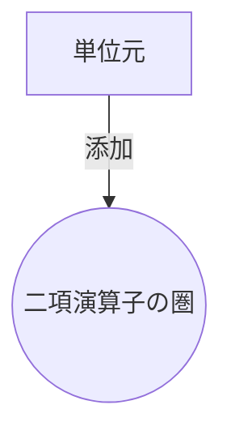
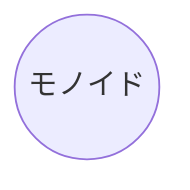
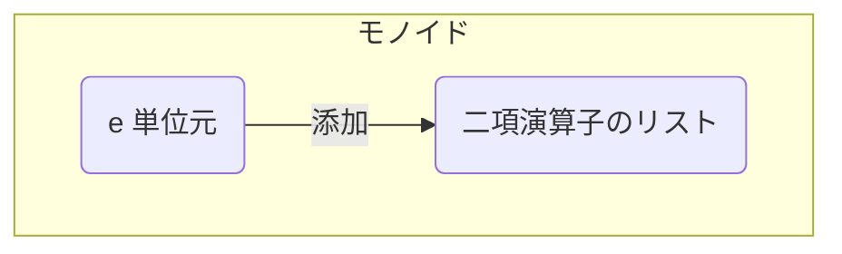

# だれでもわかるモナドプログラミング /０から作るモナド

## 長い前置き
長いので斜め読みしても読み飛ばしてもらっても構いません。
ただ特にこのトピックについて前々から思っていることが鬱積しているので、是非表明しておきたいのと同時に、一応、この解説文章の方針を示しています。
本論を読んで筆者にひとこと文句を言いたくなったらまずここを読んでください。

### 身近で慣れ親しんでいる事例からはじめます。
「学習」「理解」とは、すでに頭の中に存在している手持ちの概念の拡張工事でしか成し遂げられません。身近で慣れ親しんでいる事例、概念を土台として、そこを足がかりに一歩ずつだけ先に進むことが出来る。そういう地道な連鎖が学習です。いきなりプラトン哲学を語れる乳幼児は存在しないでしょう。我々は皆、極めて具体的な身体的体験を通じて少しずつ知的な縄張りを広めていき世界を抽象的にも理解できるようになっているのです。
できるだけ具体的な事例から出発し、なるだけ連続性を損なわないように抽象度をあげていきます。そして切りの良いところで、今度は逆にまた具体的な事例へ戻し、その抽象的な概念が実用的に応用できるメリットのあることだと理解を深めます。
なによりこれは発見の連続ですから面白い作業のはずです。

### なるだけ難しい用語は使いません
最低限の新規用語しか提示しません。これには理由があってわざとです。
上の項目の延長として、個人的に、用語と概念は密接に繋がっているべきであると考えます。同じ概念を説明するのに複数の言葉が存在するとまずいことになります。もっとも身近で顕著な事例が外国語で、「犬」というのが英語では「DOG」ということは誰でも知っていても他の外国語でなんというか知ってる人は少ないでしょう。極めて単純な概念であっても、ただ外国語で話されるだけで相互理解が急激に困難になります。わからない言葉で話される、説明される、ということによる機会損失は甚大です。あとから、なーんだ、あの外国語って犬のことを言っていたのか！だったり、日本語であっても、ねえ、それって結局XXのことを言ってるの？なら最初からそう言ってくれてたら話が早かったのに、もったいぶってかっこつけてるの？みたいなことはなるだけ避けたい、ということです。
ただしかし、「犬」「DOG」では済まない、なんか特段に面白いモノであったりコトであったりすると、それは後々使いまわせる概念として、タグ付けしやすいので新しい名前を獲得しておきたいところです。ここでいうとまず「モナド」というのがそういう新しい用語になっているわけですが、この文章を読んでいる人の多くはまだ、手持ちの道具からの拡張工事の結果この概念にまでたどり着いていないわけです。

ただし、やはり内輪だけで通用する専門用語を使いまわせるというのはエリート気分も味わえて気持の良いものですし、恥もかかなくてすみます。そしてやはりローカルルールが適用されて、一般的に流通する言葉とは意味のズレが存在することは多いので、後々の参照のために念の為に用語を紹介したりはします。しかしその用語はここでの概念共有、理解のために必須というわけではありません。

またその学問の先駆者の名前がついた用語を使うことで、その学問や研究者へ敬意を払う、みたいな意味もありますが、おうおうにしてそのよく知らない外国人の名前がその概念を難しく感じさせたりします。

モナドにしたって、そもそもは厳密に数学分野の理論背景がある！とかいわれていたはずなのに、モナド (プログラミング)とか、「プログラミングの分野においてのモナドとは」みたいに、Wikipediaであるとかブログであるとか（かっこ）つきで説明されはじめていたり、専門用語（プログラミング）としてズレが生じているみたいなので、「専門用語」というのも話半分に聞いていたほうが良いです。その危険性を避けるためにまた圏論とかを引用するわけですが、これはもちろんほとんどの学習者にとっての「学習の土台」としてはすでに述べたとおり機能しないわけで、非常に泥沼にハマっていると個人的には感じます。









```js
(() => {
  "use strict";

  const M = require("./index");

  const toList = arr => arr.reduce((a, b) => (a)(b), (M));

  const mlog = m => o => {
    console.log(m + "\n" + o.val);
    return o;
  };

  const util = require("util");
  const validate = a => b => util.inspect(a) === util.inspect(b)
    ? true : false;

  const f = x => (M)(x + 7);
  const g = x => (M)(x * 5);
  const a = 9;
  const m = (M)(3)(5)(7);

  console.log(
    validate(
      (M)(a).bind(f)
    )(
      f(a)
    )
  );
  console.log(
    validate(
      m.bind(M)
    )(
      m
    )
  );
  console.log(
    validate(
      m.bind(f)
        .bind(g)
    )(
      m.bind(x => f(x)
        .bind(g))
    )
  );

  mlog("----------")(
    (M)(1)(2)(M)(3)
  );


  const x = (M)(1);
  const y = (M)(2);
  const z = (M)(10);

  console.log((M)(M)(M));

  const xyz = (x)(y)(z);
  mlog("xyz----------")(
    xyz
  );

  mlog("--fold----")(
    (M)(1)(2)(9)
      .fold((a, b) => (a + b))
  );
  mlog("--fold2----")(
    (M)(2)(1)
      .fold((a, b) => (10 * a + b))
  );
  mlog("--fold3----")(
    (M)(2)(1)
      .fold((a, b) => (M)(b))
  );

  console.log("IO monoid=================");
  (M)(1)(2)(9)
    .fold((a, b) => {
      const result = a + b;
      console.log("IO: " + result);
      return (result);
    });

  mlog("monoid ============")(
    (M)(10)(20)(30)
      .fold((a, b) => (M)(a)(b))
  );

  mlog("monoid ============")(
    (M)(10)(20)(30)
      .fold((a, b) => (M)(a)(b * 2))
  );

  mlog("monoid ============")(
    (M)(10)(20)(30)
      .fold((a, b) => (M)(b * 2)(a))
  );


  console.log("state monoid=================");
  (M)("state0")("update1")("update2")
    .fold((oldState, update) => {
      console.log("sate:" + oldState);
      console.log("update:" + update);
      return (update);
    });

  console.log("+++++++++++++++++++");

  mlog("fold to map")(
    (M)(10)(20)(30)(40)
      .bind(a => a * 2)
  );

  mlog("--fold- MM---")(
    (M)(10)(20)(30)(40)
      .fold((a, b) => (M)(a)(b)(a)(b))
  );

  const add1 = (a) => (M)(a + 1);

  mlog("---bind---")(
    (M)(9).bind(add1)
  );

  mlog("------")(
    (M)(999)(9).bind(add1)
  );
  mlog("--bind----")(
    (M)(9)(8)
      .bind((a) => (a))
  );
  const add5 = (a => a + 5);
  mlog("--bind5----")(
    (M)(100)(101)
      .bind(add5)
  );
  const add10 = a => a + 5;
  mlog("--bind10----")(
    (M)(100)(101)
      .bind(add5)
      .bind(add5)
  );
  mlog("------")(
    (M)(add1)(add1).bind(f => f(3)) //
  );
  mlog("------")(
    (M)(add1).bind(f => f(3)) //4
  );

  mlog("------")(
    (M)(9).bind(x => x)
  );

  console.log("------");

  const double = (a) => (M)(a)(a);

  mlog("xyz--bind------")(
    xyz
      .bind(double)
      .bind(double)
      .bind(add1)
  );


  const add20 = x => x + 20;
  const compose = (f, g) => (x => g(f(x)));
  //console.log(m);
  mlog("--fold--compose 0--")(
    (M)(100).bind(add20)
  );

  mlog("--fold--compose--")(
    (M)(100)(200).bind(
      M(add20)(add20)(add20).fold(compose)
    )
  );

  const plus = (x) => (y => x + y);
  const plus1 = (M)(1)
    .bind(plus);

  mlog("--123 p1 p1----")(
    (M)(1)(2)(3)
      .bind(plus1)
  );
  mlog("--fold----")(
    (M)(1)(2)(3)
      .bind(plus1)
      .fold((a, b) => (a + b))
  );


})();


```
